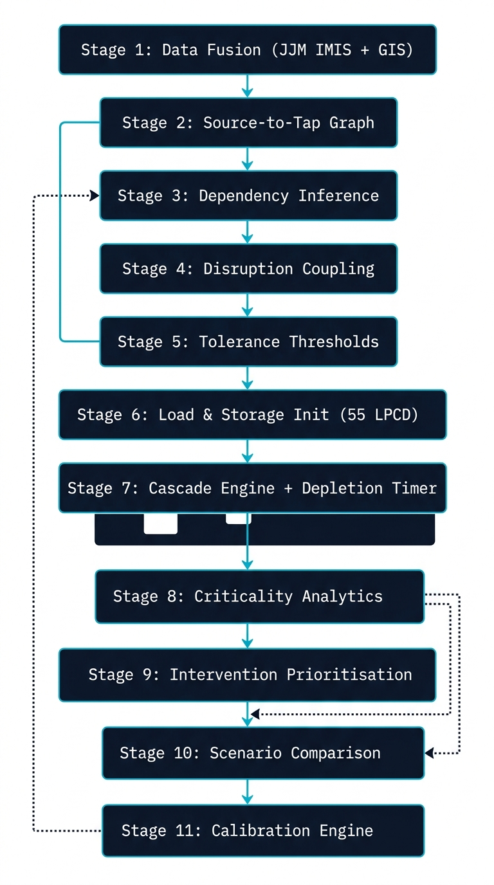
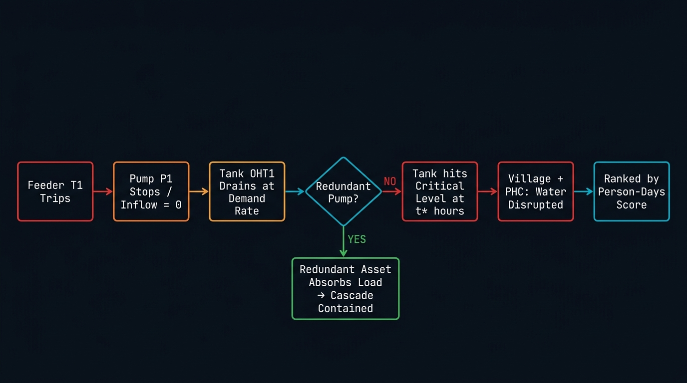

# SWIM - Water Resilience Digital Twin
### Cascading Failure Simulator for Rural Water Infrastructure

> **MIT Manipal Tech Tatva 2026 - Team MKCrusaders26**

---

## The One-Sentence Pitch

JalRakshak answers the question no existing water monitoring system can: **"Pump P1 is OFF -- what does that mean for the 6,400 people downstream, how many hours do they have before their taps run dry?"**

---

## The Problem That Actually Exists Today

India's Jal Jeevan Mission has geo-tagged **~6 crore rural water assets** across the country. Every block engineer can see whether a pump is ON or OFF in real time.

**What they cannot see is what comes next.**

When a power feeder trips and a pump stops, the overhead tank keeps feeding water downstream -- draining silently. A PHC might lose supply in 4 hours. A village with no alternate source might go 3 days without water.

The standard response today is reactive: someone's tap runs dry, they file a complaint, the engineer dispatches a repair team. **The consequence has already happened.**

JalRakshak turns that into a proactive question: given this failure, here is exactly who is affected, in what order, how fast, and what the cheapest fix is -- **before** the taps run dry.

---

## Why This Is Solvable Right Now 

The missing piece was never data. It was the **dependency model** sitting on top of existing data.

| What already exists | What was missing |
|---|---|
| JJM IMIS geo-tagged assets nationwide | Which pump depends on which power feeder |
| PHED pump records and tank capacities | How long a tank lasts once its pump fails |
| Census population-per-habitation data | Which villages, PHCs, and schools lose water first |
| Block engineers who know their schemes | A tool that converts their local knowledge into ranked priorities |

JalRakshak builds that missing dependency layer -- a typed graph of how every asset in a water scheme depends on every other -- and runs a cascade simulation on top of it. **No SCADA sensors. No IoT retrofit needed.**

---

## What JalRakshak Actually Does

```
Source -> Pump -> Feeder (power) -> Overhead Tank -> Pipeline Zone -> Village / PHC / School
```

This is not a monitoring dashboard. It is a **what-if simulator**.

You select a failure -- a power feeder trips, a pump breaks down, a borewell yield drops -- and JalRakshak propagates the consequence through the full dependency chain:

1. The pump stops. Inflow to the tank drops to zero.
2. The tank drains at the demand rate of everything it feeds (55 LPCD x population served).
3. The system calculates exactly when the tank hits its critical threshold: `t* = (storage - minimum) / demand_rate`
4. Every village, PHC, and anganwadi downstream is marked affected at that time.
5. The system ranks every asset by **person-days of disrupted supply** -- a concrete, fundable number.
6. It then tells you the smallest, cheapest intervention that would have prevented it.

### The Core Technical Insight

A bridge failure is felt immediately. A pump failure is not -- the tank buys time. **That buffer is exactly what this system computes, and it is the single sentence no other water dashboard currently answers.**

> "Pump P1 is off. OHT1 will reach critical storage level in **6 hours**. Village Chakur (2,100 people) and PHC Chakur (serving 6,400) will lose water supply. No redundant pump exists. Intervention priority: Install standby pump -- Rs.3-7 Lakh."

---

## System Overview

JalRakshak provides a complete digital twin of rural water infrastructure -- from data ingestion through cascade simulation to intervention planning. Here's the system in action:

### Landing & Scheme Selection
Engineers start by selecting their water scheme. The system loads the full network graph with all asset dependencies precomputed.


### Interactive Network Map & Asset Inspector
Every asset is pinned at real GPS coordinates. Clicking any node opens the Asset Inspector: criticality score, connected neighbours, and data provenance. Dependencies flagged as uncertain are highlighted for human correction.


### Dependency Review & Calibration
The system surfaces inferred pump-to-feeder dependencies with confidence scores. Engineers confirm or correct each edge. The Calibration Score improves with every correction, making the digital twin progressively more accurate.


### Failure Scenario Selection & Cascade Simulation
Choose a failure type (feeder trip, pipeline burst, source depletion) and watch the cascade propagate round-by-round on the live map. Node colours shift from green → amber → red as assets move through stressed → critical → failed states.


---

## Architecture

### 11-Stage Processing Pipeline



| Stage | What it does | Key standard / source |
|---|---|---|
| **1. Data Fusion** | Merges JJM IMIS, PHED registries, DISCOM feeder data, CGWB groundwater, Census | JJM IMIS, State PHED/RWS |
| **2. Source-to-Tap Graph** | Builds a typed real-coordinate graph: source -> pump -> tank -> pipeline zone -> demand nodes | Geographic + scheme data |
| **3. Dependency Inference** | Infers which feeder powers which pump using proximity + routing; confidence-scored; human-correctable | KD-tree + Dijkstra |
| **4. Disruption Coupling** | Fail power / fail pump / fail source / fail pipeline -- any node, any intensity, instant or gradual | Swappable interface |
| **5. Tolerance Thresholds** | Per-asset fragility: pump dry-run voltage tolerance, pipe age-material leak curves | PHED O&M norms |
| **6. Load & Storage Init** | Sets demand at 55 LPCD x population; tank capacity at 25-35% of daily demand | JJM norm + CPHEEO Manual |
| **7. Cascade Engine + Depletion Timer** | Round-by-round propagation; computes t* per tank; Two-Axis Monte Carlo for uncertainty | Domain-adapted model |
| **8. Criticality Analytics** | Ranks by person-days of disrupted supply; flags single-point-of-failure schemes | Population x hours metric |
| **9. Intervention Prioritisation** | Binary-search minimum redundancy sizing: how much extra storage/pump capacity prevents failure | Monotonic binary search |
| **10. Scenario Comparison** | Paired runs sharing random draws -- "with vs without intervention" -- statistically clean comparison | Common random numbers |
| **11. Calibration Engine** | VWSC/block-engineer corrections and JJM status updates improve inference confidence over time | Beta-Binomial update |

### Cascade Failure Flow



---

## Prototype -- What The Current Demo Shows

> **Important note:** The current prototype is a **hardcoded front-end demo** built for MIT Manipal Tech Tatva 2026. All data (nodes, edges, scenarios, cascade timelines) is pre-loaded from static TypeScript files. The production version will fetch live data from APIs and databases.

| Step | Screen | What it demonstrates |
|---|---|---|
| 1 | Landing | Problem framing + scheme selection |
| 2 | Network Map | Interactive Leaflet map of all 25 scheme assets with real Chakur Block coordinates |
| 3 | Dependency Review | Inferred pump-to-feeder dependencies flagged for human correction |
| 4 | Failure Selection | Choose: Feeder trip / Pipeline burst / Source depletion / Worst case |
| 5 | Cascade Animation | Round-by-round simulation with live map colouring -- red = failed, amber = stressed |
| 6 | Impact + Criticality | Population without water, hours to critical, facility count, ranked criticality table |
| 7 | Scenario Comparison | Side-by-side comparison + cost-effective intervention recommendation |

---

## Tech Stack

Everything used is **free, open-source, and production-ready**.

### Frontend Framework

| Tool | What it does | Why we chose it |
|---|---|---|
| **Next.js 14** | React framework with page routing | Fast, industry standard, SSR support |
| **TypeScript** | Typed JavaScript | Catches bugs at compile time -- critical for simulation logic |
| **Tailwind CSS** | Utility CSS classes | Rapid, consistent styling |

### Map & Visualisation

| Tool | What it does | Why we chose it |
|---|---|---|
| **Leaflet + react-leaflet** | Interactive maps with real coordinates | Open-source, lightweight, OpenStreetMap tiles |
| **OpenStreetMap** | Base map tiles | Free, no API key needed |
| **SVG DivIcons** | Custom asset markers (pump, tank, borewell icons) | Renders at any zoom level |
| **CSS Polylines** | Pipe and dependency edge rendering | Drawn natively on the map canvas |

### Simulation Logic

| Tool | What it does | Why we chose it |
|---|---|---|
| **Static TypeScript data files** | `nodes.ts`, `edges.ts`, `scenarios.ts` -- all scheme data | Hardcoded for prototype; swappeable with API calls in production |
| **`cascadeEngine.ts`** | Round-by-round cascade propagation + depletion timer | Custom logic, ~200 lines, runs client-side in <1ms per round |
| **`statusUtils.ts`** | Maps node types to colours, labels, and icon styles | Centralised design system for the map layer |

### Fonts & Icons

| Tool | What it does |
|---|---|
| **Lucide React** | Clean SVG icon set for UI elements |
| **Google Fonts -- Inter** | Primary typeface |

### Development & Deployment

| Tool | What it does |
|---|---|
| **npm / Node.js 18+** | Package management and dev server |
| **`next dev`** | Local development server at `localhost:3000` |
| **Vercel** | Zero-config deployment target for Next.js |

---

## Data Sources (Production Version)

| Source | Publisher | What it provides |
|---|---|---|
| **JJM IMIS** | Dept. of Drinking Water & Sanitation | Scheme assets, pump/tank locations, functionality status |
| **State PHED / RWS registries** | State governments | Scheme DPR figures, pump specs, tank capacities |
| **State DISCOM feeder records** | State electricity boards | Which feeder serves which pump connection |
| **CGWB / India-WRIS** | Central Ground Water Board | Groundwater levels -- source reliability fragility curves |
| **IMD** | India Meteorological Department | Rainfall and drought indicators |
| **Census / SECC** | Government of India | Population per habitation for demand estimation |
| **CPHEEO Manual** | Ministry of Housing and Urban Affairs | 55 LPCD design norm; 25-35% daily demand storage sizing |
| **BIS 10500** | Bureau of Indian Standards | Drinking water quality standard |

Every data input is tagged by provenance: `measured` (confirmed), `inferred` (confidence-scored), or `engineering default` (a named published standard). Nothing is silently assumed.

---

## The Core Simulation Formula (Plain English)

When a pump fails, the tank does not immediately run dry. It drains gradually:

```
Time to critical = (Current storage - Minimum safe level) / Demand rate per hour
```

**Example:**
- Tank OHT1: 100 kL total, currently 80 kL full
- Minimum safe level: 20 kL (20% threshold per CPHEEO standard)
- Demand: 1,100 people x 55 LPCD = 60.5 kL/day = 2.52 kL/hour
- **Time to critical = (80 - 20) / 2.52 = ~24 hours**

This one formula turns "Pump is OFF" into "you have 24 hours." The system computes this for every tank simultaneously, then propagates which villages and facilities run dry at which hours -- for any failure, instantly.

---

## Running Locally

**Prerequisites:** Node.js 18+ and npm 9+

```bash
git clone https://github.com/SudarshanG9/MIT-TechTattva---Team-MKCrusaders26.git
cd MIT-TechTattva---Team-MKCrusaders26
npm install
npm run dev
```

Open http://localhost:3000 in your browser. The map requires an internet connection for OpenStreetMap tiles. All simulation logic runs entirely client-side.

---

## Complete 7-Step User Flow

### Step 1 -- Open the Command Centre

The engineer opens JalRakshak and sees the **Chakur Block, Latur** scheme preloaded: 25 assets, 34 dependency links, 8,140 people served under JJM. They click **Chakur Block** to load the digital twin.

---

### Step 2 -- Inspect the Network on the Live Map

A full-screen interactive map loads at real GPS coordinates. Every asset is pinned with a distinct icon:

- Borewells -- the root source of the water tree
- Pump Houses -- the only thing pushing water uphill into the tank
- Power Feeders -- the hidden dependency most dashboards ignore
- Overhead Tanks -- the time buffer the simulation measures
- Pipeline Zones -- the distribution network
- PHCs and Anganwadis -- critical facilities at the end of the chain
- Villages -- the demand nodes

Clicking any asset opens the **Asset Inspector panel**: criticality score, connected neighbours, and a provenance badge showing whether the dependency was confirmed from official data or inferred by the system.

---

### Step 3 -- Review and Correct Inferred Dependencies

The system surfaces 2 dependency edges it is uncertain about:

- **P1 -> T1** (Main pump powered by Feeder 1 -- inferred from proximity, 68% confident)
- **OHT2 -> P2** (South tank backup supply -- may actually be P1, 71% confident)

For each, the engineer sees the confidence level, the reason for uncertainty, and a dropdown to either Confirm or Correct the assignment. When the engineer corrects an edge, the **System Calibration Score** updates immediately, and the inference engine learns.

---

### Step 4 -- Choose a Failure Scenario

Four scenarios are presented as cards with projected impact previews:

| Scenario | What it simulates | Severity |
|---|---|---|
| Feeder T1 Trip (Start Here) | Power cut to main pump | High |
| PZ3 Pipeline Burst | Break in central distribution pipe | Medium |
| BW1 Source Depletion | Borewell yield drops to 35% | Critical |
| Worst Case | Simultaneous T1 trip + P2 failure | Critical |

---

### Step 5 -- Watch the Cascade Animate Round by Round

The engineer clicks **RUN CASCADE**. The map comes alive:

- **T+0h:** Feeder T1 trips. Pump P1 loses power. Pump marker turns red.
- **T+2h:** Tank OHT1 draining silently. Fill level below 60%. Tank turns amber.
- **T+4h:** OHT1 hits critical storage (20%). Pipeline Zone PZ1 loses pressure. Three villages and PHC Chakur turn red.
- **T+6h:** PZ2 Central drains. Four more villages affected. **5,660 people without water.**

A timeline panel shows each event with the exact reason and node ID. The engineer sees immediately: this is a 6-hour emergency, not a 24-hour problem.

---

### Step 6 -- Read the Impact Dashboard and Criticality Ranking

**Impact Dashboard:** 5,660 people without water -- 3 facilities affected -- 8 assets offline -- 6 hours to critical -- Resilience score: 0.28/1.0 -- Est. cost: Rs.3-7 Lakh

**Criticality Ranking:** A ranked list of all 25 assets. Click any asset to expand its technical justification and intervention recommendation.

> Rank 2: P1 -- Main Pump House
> "No dedicated backup pump. Failure drains largest tank within 6 hours."
> Recommended: Install 100% standby pump parallel to P1 -- Rs.3-7 Lakh

---

### Step 7 -- Compare Scenarios and Generate the Planning Report

| Metric | Baseline | T1 + DG Backup | T1 Trip | Worst Case |
|---|---|---|---|---|
| Pop. without water | 0 | 0 | 5,660 | 7,280 |
| Time to critical | -- | 12 hours | 6 hours | 3 hours |
| Resilience score | 0.92 | 0.81 | 0.28 | 0.12 |
| Est. repair cost | Rs.0 | Rs.6-12L | Rs.3-7L | Rs.18-28L |

> "A Rs.6-12 Lakh investment in a DG backup for P1 prevents entire scheme failure. Restores water security to 5,660 people. Resilience improves from 0.28 to 0.81."

The engineer clicks **Generate MJP Report** -- a formatted summary ready for budget submission to the district PHED office.

---

## What This Is Not

- Not predictive maintenance. JalRakshak does not forecast when a pump will spontaneously fail. It simulates consequences once a failure is introduced.
- Not a real-time SCADA system. It does not poll live sensor feeds. It runs fast, deterministic simulations on scheme data that already exists.
- Not a monitoring dashboard. JJM IMIS already does monitoring. JalRakshak is the consequence layer on top.

---

## Team

**Team MKCrusaders26** - MIT Manipal - Tech Tatva 2026

---

## License

MIT License
